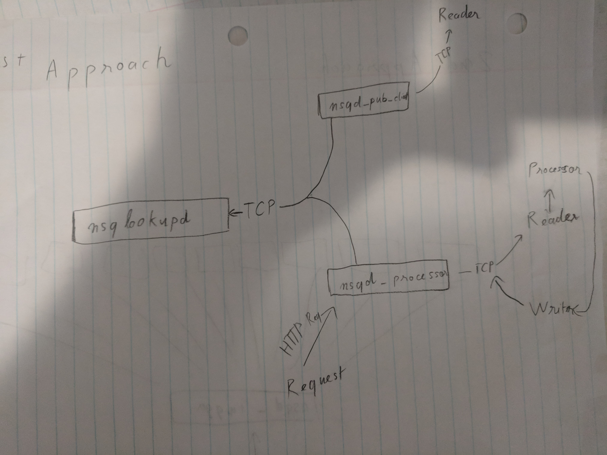
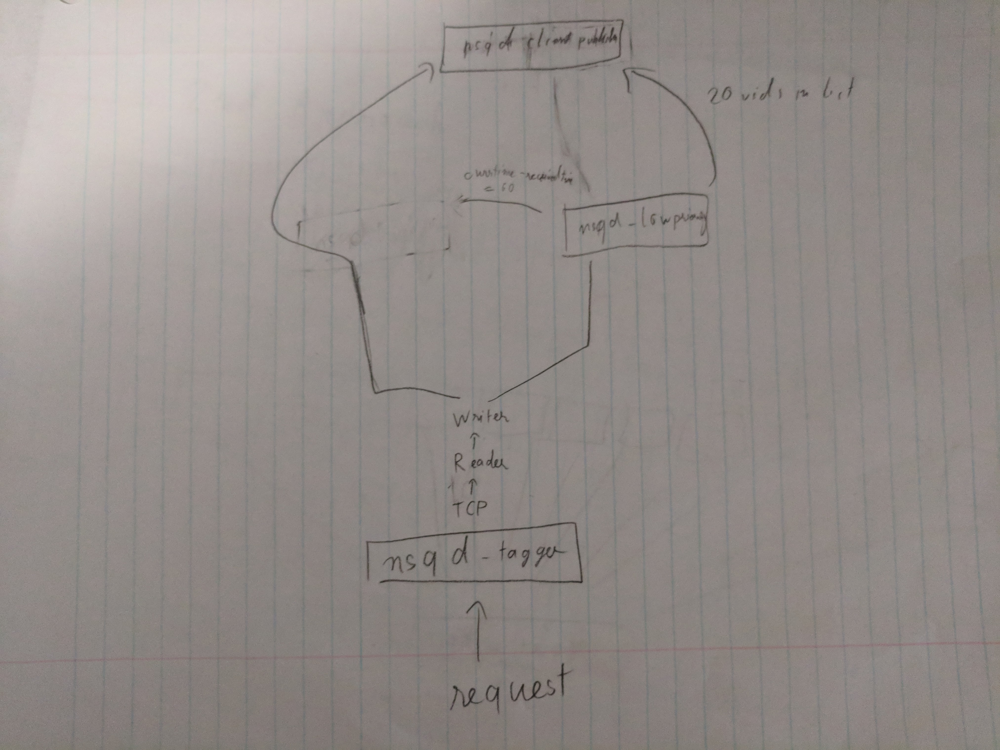
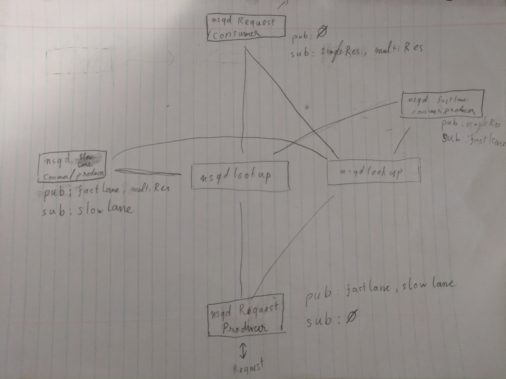

# Wistia Challenge Evaluation

First of all, I want to thank you all for introduce me to the NSQ message passing interface. It was such a blast to read and research into it. Throughout the process,not only I genuienly enjoyed solving the problems, but I also was able to come up with a few idea of my own to utilize NSQ, particularly in optimizing processing data in distributed manner.

## Approach

When I first read through the prompt and have a reasonable understanding of the tools provided, I started out with planning some naive approach and work my way up to see if there is more optimization that I can do



Above is my first approach, to have a single nsqd node as the processor and request handler. While this approach is straightforward, it is very inefficient and cannot scale horizontally.



My second approach is more reasonable, as I have an extra nsqd node that will handle caching low priority (high amount of play count) videos. This introduce a more
distributed system, as while requests are being received, processed messages can still be published.



My final architecture is a lot similar to the second approach, with another node that will handle high priority count. Furthermore, for every interval (in this case 1 minute), the processor will look into the cache and published whatever message is in it. This is to ensure that client will always have at most 1 minute updated value from their value.

## Implementation

Below is how the project is structured

```bash
├── Gemfile                                     # Gem dependencies declaration file
├── Gemfile.lock
├── Pipfile                                     # Python dependecies declaration file
├── Pipfile.lock
├── README.md                                   # Installation notes
├── __init__.py
├── cluster                                     # script for NSQ cluster. written in Ruby
│   └── start.rb
├── datagenerator.py                            # script to generate message requests
├── docs                                        # documentation
│   ├── challenge.md
│   ├── evaluation.md
│   └── images
├── main.py                                     # script to instantiate a cluster along with a processor
├── main.test.py                                # testing script
├── processor                                   # processor package
│   ├── nsqprocessor.py                         # NsqProcessor class
│   └── repeatedTimer.py                        # RepeatedTimer to perform recurring functions
└── vendor
    └── cache
```

Note that there were both Python and Ruby code within the project. The reason behind that was the `nsq-cluster` library from Ruby was extremely useful to run the project locally and I could not find an equivalent in Python.

Initially, I plan to implement the project using strictly **Python 3.7**. However, **pynsq** stable version is not compatible with it due to an use of reserved word (this has been fixed in **pynsq** new beta release). This is why the project is running in both version of **Python**

Throughout the process of development, I also ensure that project dependecies is in check, for both Python and Ruby. This allow the project to execute from any machine and can easily be automated for continuous integration.

## Potential Improvements

- Error handling: right now the processor is vulnerable against bad/incorrect message. The project definitely could be more secure if a more structured error handling is put in place
- Uniform codebase: having different language in a same codebase usually make it much more susceptible to errors. After this project, I will try to port `nsq-cluster` from Ruby over to Python as well as upgrade `pynsq` so that everything can be maintained in a single language, allowing more scalability and extensibility
- More Unit Testing: Although the main workflow is tested, each individual part of the project is still susceptiple to problems.